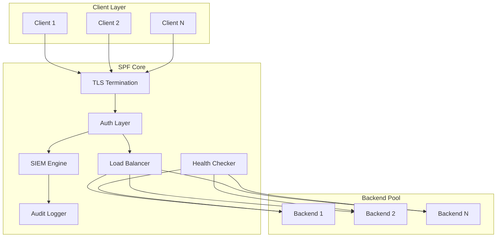

# SPF - Production Network Forwarder

**Fast, secure, lightweight TCP/UDP proxy with enterprise security features.**

```
┌─────────────┐     ┌──────────────┐     ┌─────────────┐
│   Clients   │────▶│     SPF      │────▶│  Backends   │
│             │◀────│  TLS + LB    │◀────│             │
└─────────────┘     └──────────────┘     └─────────────┘
                           │
                    ┌──────┴──────┐
                    │ SIEM Engine │
                    │ Health Chks │
                    │  Metrics    │
                    └─────────────┘
```

## Architecture



## Features

### Core
- **TCP Port Forwarding** - High-performance L4 proxy
- **TLS Termination** - OpenSSL with TLS 1.2+
- **Load Balancing** - Round-robin, least-conn, IP-hash, weighted
- **Health Checks** - Auto-detect backend failures
- **Rate Limiting** - Per-IP and global token bucket

### Enterprise Security (SIEM)
- **Audit Logging** - JSON structured events
- **IP Blocking** - Manual and automatic (brute-force)
- **Geo-IP Blocking** - Block by country
- **Threat Intelligence** - External blocklist feeds
- **Anomaly Detection** - Traffic pattern analysis
- **PROXY Protocol v2** - Preserve client IPs
- **Webhook Alerts** - Slack/Discord/PagerDuty

### Operations
- **Prometheus Metrics** - Full observability
- **Live Control** - TCP control protocol
- **Hot Reload** - Change rules without restart
- **Daemon Mode** - Background service
- **Cross-Platform** - Linux, macOS, Windows, ESP32

## Quick Start

```bash
# build
make

# run with auth token
./bin/spf --token mysecret

# connect control
nc localhost 8081
> AUTH mysecret
> ADD 8080 10.0.0.1:80,10.0.0.2:80 rr
> STATUS
```

## Installation

```bash
# debian/ubuntu
make install-deps-debian
make
sudo make install
sudo make install-service

# arch
make install-deps-arch
make
sudo make install

# macos
make install-deps-macos
make
sudo make install
```

## Control Protocol

```
AUTH <token>              # authenticate first
STATUS                    # system overview  
RULES                     # list all rules
BACKENDS <id>             # show backends for rule
ADD <port> <backends> [algo]  # add forwarding rule
DEL <id>                  # delete rule
BLOCK <ip> [seconds]      # block IP
UNBLOCK <ip>              # unblock IP  
LOGS [n]                  # recent security events
METRICS                   # prometheus format
QUIT                      # close connection
```

### Examples

```bash
# add rule with 3 backends, round-robin
ADD 443 10.0.0.1:8080,10.0.0.2:8080,10.0.0.3:8080 rr

# add rule with least-connections
ADD 80 web1:8080,web2:8080 lc

# add sticky sessions (IP hash)
ADD 3000 app1:3000,app2:3000 ip

# block abusive IP for 1 hour
BLOCK 1.2.3.4 3600
```

## CLI Options

```
-b, --admin-bind <ip>   Control bind address (default: 127.0.0.1)
-p, --admin-port <n>    Control port (default: 8081)
-t, --token <str>       Auth token (recommended)
-c, --cert <path>       TLS certificate
-k, --key <path>        TLS private key
-d, --daemon            Run as background daemon
-h, --help              Show help
```

## Load Balancing Algorithms

| Algo | Flag | Description |
|------|------|-------------|
| Round Robin | `rr` | Default, rotate through backends |
| Least Connections | `lc` | Route to least busy backend |
| IP Hash | `ip` | Sticky sessions by client IP |
| Weighted | `w` | Weighted distribution |

## Security Events

SPF logs these security events:

| Event | Description |
|-------|-------------|
| `CONN_OPEN` | New connection established |
| `CONN_CLOSE` | Connection closed |
| `AUTH_FAIL` | Failed authentication attempt |
| `BLOCKED` | IP blocked (rate limit) |
| `RATE_LIMITED` | Request rate limited |
| `HEALTH_DOWN` | Backend failed health check |
| `HEALTH_UP` | Backend recovered |
| `GEOBLOCK` | Blocked by geo-IP |
| `THREAT_MATCH` | IP matched threat intel |
| `ANOMALY` | Unusual traffic pattern |
| `DDOS` | Potential DDoS detected |

## Prometheus Metrics

```
spf_connections_active    # current connections
spf_connections_total     # total since start
spf_bytes_in_total        # bytes received
spf_bytes_out_total       # bytes sent
spf_blocked_total         # blocked IPs
spf_rules_active          # active rules
```

## ESP32 Support

SPF runs on ESP32 for edge/IoT scenarios:

```bash
# configure via serial first boot
SETUP YourSSID YourPassword YourAuthToken

# then control via network
nc 192.168.1.x 8081
```

Credentials stored in NVS flash - no hardcoded secrets.

## File Structure

```
src/
├── common.h    # shared types and limits
├── core.c      # state, blocking, load balancing
├── server.cpp  # main server (linux/mac/win)
└── esp32.cpp   # embedded variant
```

## vs Competitors

| Feature | SPF | socat | rinetd | HAProxy | nginx |
|---------|-----|-------|--------|---------|-------|
| Dynamic rules | ✅ | ❌ | ❌ | ✅ | ⚠️ |
| Load balancing | ✅ | ❌ | ❌ | ✅ | ✅ |
| Health checks | ✅ | ❌ | ❌ | ✅ | ✅ |
| TLS | ✅ | ✅ | ❌ | ✅ | ✅ |
| SIEM/Security | ✅ | ❌ | ❌ | ⚠️ | ⚠️ |
| ESP32/IoT | ✅ | ❌ | ❌ | ❌ | ❌ |
| Binary size | ~50KB | ~500KB | ~20KB | ~2MB | ~5MB |

## Building

```bash
# release
make

# debug with sanitizers
make debug

# cross compile
make cross-arm
make cross-aarch64
make cross-windows

# info
make info
```

## License

GPL-2.0
