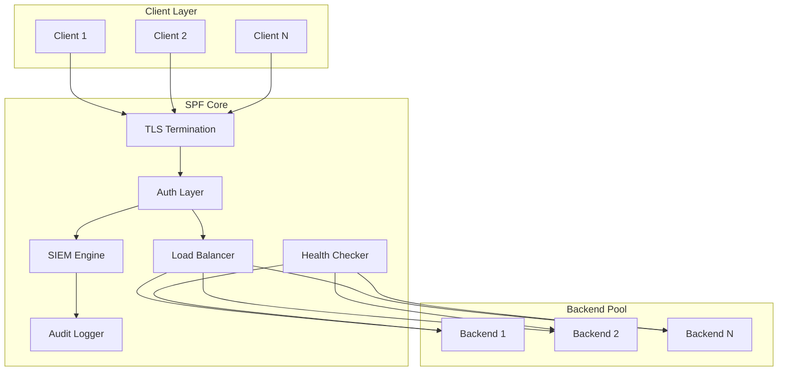

# SPF - Production Network Forwarder

**Fast, secure, lightweight TCP/UDP proxy with enterprise security features.**

**v2.1.0** - Beats rinetd, socat, and cloud LBs. Simple, powerful, extensible.

```
┌─────────────┐     ┌──────────────┐     ┌─────────────┐
│   Clients   │────▶│     SPF      │────▶│  Backends   │
│             │◀────│  TLS + LB    │◀────│             │
└─────────────┘     └──────────────┘     └─────────────┘
                           │
                    ┌──────┴──────┐
                    │ SIEM Engine │
                    │ Health Chks │
                    │  Metrics    │
                    │ Custom Hooks│
                    └─────────────┘
```

## Architecture



## Features

### Core
- **TCP Port Forwarding** - High-performance L4 proxy
- **One-liner Mode** - `spf -f 8080:backend:80` (simpler than socat!)
- **TLS Termination** - OpenSSL with TLS 1.2+
- **Load Balancing** - Round-robin, least-conn, IP-hash, weighted
- **Health Checks** - Auto-detect backend failures
- **Rate Limiting** - Per-IP and global token bucket
- **SIGHUP Reload** - Hot reload config without restart (rinetd killer)
- **Hostname Resolution** - Use hostnames not just IPs

### Enterprise Security (SIEM)
- **Audit Logging** - JSON structured events
- **Access Logs** - Cloud LB-style JSON access logs
- **IP Blocking** - Manual and automatic (brute-force)
- **Geo-IP Blocking** - Block by country
- **Custom Security Hooks** - Linux-way extensibility (any language)
- **Threat Intelligence** - External blocklist feeds
- **Anomaly Detection** - Traffic pattern analysis
- **PROXY Protocol v2** - Preserve client IPs
- **Webhook Alerts** - Slack/Discord/PagerDuty

### Operations
- **Prometheus Metrics** - Full observability
- **Live Control** - TCP control protocol
- **Hot Reload** - Change rules without restart
- **Daemon Mode** - Background service
- **Cross-Platform** - Linux, macOS, Windows, ESP32

## Quick Start

```bash
# build
make

# one-liner mode (beats socat syntax!)
./bin/spf -f 8080:mybackend.com:80

# one-liner with TLS
./bin/spf -f 443:10.0.0.1:8080 -c cert.pem -k key.pem

# run with config file
./bin/spf --token mysecret

# connect control
nc localhost 8081
> AUTH mysecret
> ADD 8080 10.0.0.1:80,10.0.0.2:80 rr
> STATUS
```

## Installation

```bash
# debian/ubuntu
make install-deps-debian
make
sudo make install
sudo make install-service

# arch
make install-deps-arch
make
sudo make install

# macos
make install-deps-macos
make
sudo make install
```

## Control Protocol

```
AUTH <token>              # authenticate first
STATUS                    # system overview  
RULES                     # list all rules
BACKENDS <id>             # show backends for rule
ADD <port> <backends> [algo] [max_conns] [accept_rate]  # add forwarding rule (accept_rate = connections/sec)
DEL <id>                  # delete rule
BLOCK <ip> [seconds]      # block IP
UNBLOCK <ip>              # unblock IP  
LOGS [n]                  # recent security events
METRICS                   # prometheus format
HOOKS                     # show active custom hooks
RELOAD                    # hot reload config (SIGHUP alternative)
QUIT                      # close connection
```

### Examples

```bash
# add rule with 3 backends, round-robin
ADD 443 10.0.0.1:8080,10.0.0.2:8080,10.0.0.3:8080 rr

# add rule with conn cap 512 and 150 cps accept throttle
ADD 8443 10.0.0.10:8443 rr 512 150

# add rule with least-connections
ADD 80 web1:8080,web2:8080 lc

# add sticky sessions (IP hash)
ADD 3000 app1:3000,app2:3000 ip

# block abusive IP for 1 hour
BLOCK 1.2.3.4 3600
```

## CLI Options

```
-C, --config <path>      Config file (default: spf.conf)
-b, --admin-bind <ip>    Control bind address (default: 127.0.0.1)
-p, --admin-port <n>     Control port (default: 8081)
-t, --token <str>        Auth token (recommended)
-c, --cert <path>        TLS certificate
-k, --key <path>         TLS private key
-d, --daemon             Run as background daemon
-f, --forward <spec>     Quick forward: listen:backend:port (one-liner)
-H, --hooks-dir <path>   Custom security hooks directory
-A, --access-log <path>  Access log file path
-h, --help               Show help
```

## One-Liner Mode (Beats socat!)

Pain point: socat has cryptic syntax like `socat TCP-LISTEN:8080,fork TCP:backend:80`

SPF makes it simple:

```bash
# basic forward
spf -f 8080:backend.example.com:80

# with TLS termination
spf -f 443:10.0.0.1:8080 -c cert.pem -k key.pem

# with access logging
spf -f 8080:myserver:80 -A /var/log/spf/access.log

# with custom hooks
spf -f 8080:myserver:80 -H /etc/spf/hooks.d
```

## Load Balancing Algorithms

| Algo | Flag | Description |
|------|------|-------------|
| Round Robin | `rr` | Default, rotate through backends |
| Least Connections | `lc` | Route to least busy backend |
| IP Hash | `ip` | Sticky sessions by client IP |
| Weighted | `w` | Weighted distribution |

### Per-Rule Safety Limits

- `max_conns` (optional): maximum concurrent connections for the rule (default 512). Extra accepts are dropped and reported as `RATE_LIMITED`.
- `accept_rate` (optional): allowed new connections per second for the rule (default 200 or `security.rate_global` if set). Enforced via token bucket at accept time.

These can be set via the `ADD` command or config keys:

```
[rule.10001]
listen = 8080
lb = rr
max_conns = 512
accept_rate = 150
backend = 10.0.0.1:80:1
backend = 10.0.0.2:80:1
```

## Security Events

SPF logs these security events:

| Event | Description |
|-------|-------------|
| `CONN_OPEN` | New connection established |
| `CONN_CLOSE` | Connection closed |
| `AUTH_FAIL` | Failed authentication attempt |
| `BLOCKED` | IP blocked (rate limit) |
| `RATE_LIMITED` | Request rate limited |
| `HEALTH_DOWN` | Backend failed health check |
| `HEALTH_UP` | Backend recovered |
| `GEOBLOCK` | Blocked by geo-IP |
| `THREAT_MATCH` | IP matched threat intel |
| `ANOMALY` | Unusual traffic pattern |
| `DDOS` | Potential DDoS detected |

## Prometheus Metrics

```
spf_connections_active    # current connections
spf_connections_total     # total since start
spf_bytes_in_total        # bytes received
spf_bytes_out_total       # bytes sent
spf_blocked_total         # blocked IPs
spf_rules_active          # active rules
```

## Access Logging (Cloud LB Style)

Pain point: Cloud LBs like AWS ALB have great access logs. SPF matches them!

Enable with `-A /var/log/spf/access.log` and get JSON logs like:

```json
{"timestamp":"2024-12-25T15:30:45Z","client_ip":"192.168.1.50","client_port":54321,"rule_id":10001,"backend":"10.0.0.1:8080","bytes_in":1024,"bytes_out":65536,"duration_ms":1523,"status_code":200}
```

Perfect for:
- Debugging connection issues
- Security forensics
- Traffic analysis
- Compliance auditing

## Hot Reload (SIGHUP)

Pain point: rinetd requires restart to change config. SPF doesn't!

```bash
# edit config
vim /etc/spf/spf.conf

# reload without restart
kill -SIGHUP $(pidof spf)

# or via control protocol
echo "AUTH mytoken\nRELOAD" | nc localhost 8081
```

## ESP32 Support

SPF runs on ESP32 for edge/IoT scenarios:

```bash
# configure via serial first boot
SETUP YourSSID YourPassword YourAuthToken

# then control via network
nc 192.168.1.x 8081
```

Credentials stored in NVS flash - no hardcoded secrets.

## Custom Security Hooks (Linux-way Extensibility)

Pain point: Commercial proxies have rigid security rules. SPF lets you use ANY language.

Hooks are scripts/programs in `/etc/spf/hooks.d/` that receive connection info via environment variables and return exit codes to control behavior.

### Hook Types

| Hook | When | Purpose |
|------|------|---------|
| `on_connect_*` | Before accepting | Allow/block connection |
| `on_disconnect_*` | After close | Logging, cleanup |
| `on_block_*` | When IP blocked | Alert, audit |
| `on_health_*` | Backend status change | Alert, failover |

### Environment Variables

```bash
SPF_CLIENT_IP=192.168.1.50
SPF_CLIENT_PORT=54321
SPF_RULE_ID=10001
SPF_BACKEND_IP=10.0.0.1
SPF_BACKEND_PORT=8080
SPF_TIMESTAMP=1703521234
SPF_EVENT_TYPE=on_connect
```

### Return Codes

| Code | Meaning |
|------|---------|
| 0 | ALLOW connection |
| 1 | BLOCK connection |
| 2 | RATE_LIMIT (soft block) |
| Other | ALLOW (fail-open for safety) |

### Example: Python GeoIP Hook

```python
#!/usr/bin/env python3
# /etc/spf/hooks.d/on_connect_geoip.py

import os
import sys
import geoip2.database

BLOCKED_COUNTRIES = {'RU', 'CN', 'KP'}

client_ip = os.environ.get('SPF_CLIENT_IP')
reader = geoip2.database.Reader('/var/lib/GeoIP/GeoLite2-Country.mmdb')

try:
    country = reader.country(client_ip).country.iso_code
    if country in BLOCKED_COUNTRIES:
        sys.exit(1)  # BLOCK
except:
    pass

sys.exit(0)  # ALLOW
```

### Example: Bash Rate Limiter

```bash
#!/bin/bash
# /etc/spf/hooks.d/on_connect_ratelimit.sh

IP="$SPF_CLIENT_IP"
LIMIT=100  # connections per minute
WINDOW=60

COUNT=$(cat /tmp/spf_rl_$IP 2>/dev/null || echo 0)
NOW=$(date +%s)
LAST=$(stat -c %Y /tmp/spf_rl_$IP 2>/dev/null || echo 0)

if [ $((NOW - LAST)) -gt $WINDOW ]; then
    COUNT=0
fi

COUNT=$((COUNT + 1))
echo $COUNT > /tmp/spf_rl_$IP

if [ $COUNT -gt $LIMIT ]; then
    exit 2  # RATE_LIMIT
fi

exit 0  # ALLOW
```

### Example: Go Threat Intel Check

```go
// /etc/spf/hooks.d/on_connect_threatintel (compiled binary)
package main

import (
    "os"
    "net/http"
    "io/ioutil"
)

func main() {
    ip := os.Getenv("SPF_CLIENT_IP")
    resp, _ := http.Get("https://api.abuseipdb.com/check/" + ip)
    body, _ := ioutil.ReadAll(resp.Body)
    
    if strings.Contains(string(body), "\"isMalicious\":true") {
        os.Exit(1)  // BLOCK
    }
    os.Exit(0)  // ALLOW
}
```

## File Structure

```
src/
├── common.h    # shared types and limits
├── core.c      # state, blocking, load balancing
├── server.cpp  # main server (linux/mac/win)
└── esp32.cpp   # embedded variant
```

## vs Competitors

| Feature | SPF | socat | rinetd | HAProxy | nginx | Cloud LB |
|---------|-----|-------|--------|---------|-------|----------|
| Dynamic rules | ✅ | ❌ | ❌ | ✅ | ⚠️ | ✅ |
| One-liner mode | ✅ | ⚠️ | ❌ | ❌ | ❌ | ❌ |
| Hot reload | ✅ | ❌ | ❌ | ✅ | ✅ | ✅ |
| Load balancing | ✅ | ❌ | ❌ | ✅ | ✅ | ✅ |
| Health checks | ✅ | ❌ | ❌ | ✅ | ✅ | ✅ |
| TLS | ✅ | ✅ | ❌ | ✅ | ✅ | ✅ |
| Custom hooks | ✅ | ❌ | ❌ | ⚠️ | ⚠️ | ❌ |
| Access logs | ✅ | ❌ | ❌ | ✅ | ✅ | ✅ |
| SIEM/Security | ✅ | ❌ | ❌ | ⚠️ | ⚠️ | ⚠️ |
| Hostnames | ✅ | ✅ | ❌ | ✅ | ✅ | ✅ |
| ESP32/IoT | ✅ | ❌ | ❌ | ❌ | ❌ | ❌ |
| Self-hosted | ✅ | ✅ | ✅ | ✅ | ✅ | ❌ |
| No vendor lock-in | ✅ | ✅ | ✅ | ✅ | ✅ | ❌ |
| Binary size | ~59KB | ~500KB | ~20KB | ~2MB | ~5MB | N/A |

### Why SPF over competitors?

**vs rinetd:**
- ✅ SIGHUP hot reload (rinetd needs restart)
- ✅ Health checks (rinetd has none)
- ✅ Load balancing (rinetd is 1:1 only)
- ✅ TLS termination (rinetd has none)
- ✅ Hostnames (rinetd is IP-only)

**vs socat:**
- ✅ Simple syntax (`spf -f 8080:host:80` vs `socat TCP-LISTEN:8080,fork TCP:host:80`)
- ✅ Built-in load balancing
- ✅ Health checks
- ✅ Persistent daemon (socat is per-connection)
- ✅ Admin API for live changes

**vs Cloud LBs (AWS ALB/NLB, GCP, Azure):**
- ✅ Self-hosted (no cloud costs)
- ✅ No vendor lock-in
- ✅ Instant provisioning (vs 2-5 minutes)
- ✅ Custom security hooks (any language)
- ✅ Full control over config
- ✅ Same access log format

## Building

```bash
# release
make

# debug with sanitizers
make debug

# cross compile
make cross-arm
make cross-aarch64
make cross-windows

# info
make info
```

## License

GPL-2.0
