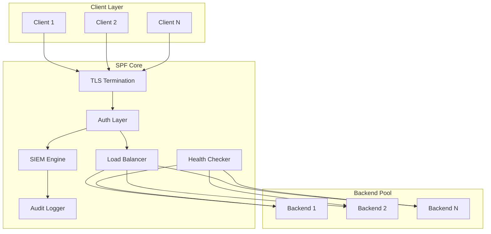

# SPF - Secure Public Forwarder

**The safest way to expose self-hosted TCP services to the public with a tiny footprint.**

```
┌─────────────┐     ┌──────────────┐     ┌─────────────┐
│   Clients   │────▶│     SPF      │────▶│  Backends   │
│             │◀────│  TLS + LB    │◀────│             │
└─────────────┘     └──────────────┘     └─────────────┘
                           │
                    ┌──────┴──────┐
                    │ SIEM Engine │
                    │ Health Chks │
                    │  Metrics    │
                    └─────────────┘
```

## Architecture


```mermaid
graph TB
    subgraph "Client Layer"
        C1[Client 1]
        C2[Client 2]
        C3[Client N]
    end
    
    subgraph "SPF Core"
        TLS[TLS Termination]
        AUTH[Auth Layer]
        LB[Load Balancer]
        HC[Health Checker]
        SIEM[SIEM Engine]
        LOG[Audit Logger]
    end
    
    subgraph "Backend Pool"
        B1[Backend 1]
        B2[Backend 2]
        B3[Backend N]
    end
    
    C1 --> TLS
    C2 --> TLS
    C3 --> TLS
    TLS --> AUTH
    AUTH --> LB
    LB --> B1
    LB --> B2
    LB --> B3
    HC --> B1
    HC --> B2
    HC --> B3
    AUTH --> SIEM
    SIEM --> LOG
```

## Positioning (Painpoint First)

The strongest painpoint SPF targets is this:

**"I need to expose my app publicly, but I do not want to run a massive reverse-proxy stack or accidentally expose an unauthenticated admin/control plane."**

SPF is built for operators who want:
- dynamic L4 forwarding
- strict defaults around control-plane safety
- small binary, simple deployment, and high signal observability

## Features

### Core
- **TCP Port Forwarding** - High-performance L4 proxy
- **TLS Termination** - OpenSSL with TLS 1.2+
- **Load Balancing** - Round-robin, least-conn, IP-hash, weighted
- **Health Checks** - Auto-detect backend failures
- **Rate Limiting** - Per-IP and global token bucket

### Enterprise Security (SIEM)
- **Audit Logging** - JSON structured events
- **IP Blocking** - Manual and automatic (brute-force)
- **Geo-IP Blocking** - Block by country
- **Threat Intelligence** - External blocklist feeds
- **Anomaly Detection** - Traffic pattern analysis
- **PROXY Protocol v2** - Preserve client IPs
- **Webhook Alerts** - Slack/Discord/PagerDuty
- **Admin Lockout & Rate Limiting** - Brute-force and abuse protection on control plane
- **Readonly Control Sessions** - Separate readonly token for safe ops access
- **Tamper-Evident Audit Chain** - JSON audit entries with hash chaining
- **Dual-Control Config Apply** - Stage/apply/rollback workflow for admin config changes

### Operations
- **Prometheus Metrics** - Full observability
- **Live Control** - TCP control protocol
- **Hot Reload** - Change rules without restart
- **Daemon Mode** - Background service
- **Cross-Platform** - Linux, macOS, Windows, ESP32

### Reliability & Safety Defaults
- **Config Rules Start on Boot** - Persisted rules are actively started at launch
- **Safer Forwarding Path** - Handles partial socket writes to avoid data truncation
- **Hardened Input Parsing** - Strict numeric parsing for ports/rates in config and CLI
- **Control-Plane Guardrail** - Refuses non-loopback admin bind without token

## Quick Start

```bash
# build
make

# run with auth token
./bin/spf --token mysecret

# connect control
nc localhost 8081
> AUTH mysecret
> ADD 8080 10.0.0.1:80,10.0.0.2:80 rr
> STATUS
```

Run validation quickly:

```bash
make test
```

Use the hardened config template:

```bash
cp spf.conf.example spf.conf
```

## Safe Exposure Checklist

Use this checklist before exposing SPF on a public or shared network:

1. Always set `--token` (or `admin.token` in config).
2. Keep admin bind on loopback unless absolutely required.
3. If exposing admin remotely, require TLS/mTLS and firewall-restrict source IPs.
4. Enable `security.enabled = true` and set reasonable rate limits.
5. Scrape metrics and alert on `spf_blocked_total`, backend down events, and active connection spikes.

SPF enforces one guardrail by default now: if admin bind is non-loopback and no token is set, startup fails.

## Installation

```bash
# debian/ubuntu
make install-deps-debian
make
sudo make install
sudo make install-service

# arch
make install-deps-arch
make
sudo make install

# fedora/rhel/centos
make install-deps-fedora
make
sudo make install

# opensuse
make install-deps-suse
make
sudo make install

# alpine
make install-deps-alpine
make
sudo make install

# macos
make install-deps-macos
make
sudo make install
```

## Packaging

SPF ships distro-friendly packaging targets:

```bash
# local Debian package
make package-deb VERSION=2.0.0

# local RPM package
make package-rpm VERSION=2.0.0

# build both
make package-all VERSION=2.0.0
```

Install from package:

```bash
sudo apt install ./spf_2.0.0_amd64.deb
sudo dnf install ./spf-2.0.0-1.x86_64.rpm
```

For packagers, `DESTDIR` is supported:

```bash
make DESTDIR="$(pwd)/build/stage" install
```

More details: `docs/packaging.md`

## Control Protocol

```
AUTH <token>              # authenticate first
STATUS                    # system overview  
RULES                     # list all rules
BACKENDS <id>             # show backends for rule
ADD <port> <backends> [algo]  # add forwarding rule
DEL <id>                  # delete rule
PAUSE <id>                # stop accepting new conns for rule
RESUME <id>               # resume accepting for rule
DRAIN <id> <idx> [sec]    # gracefully drain backend index
SETWEIGHT <id> <idx> <w>  # set backend weight
SETSTATE <id> <idx> <UP|DOWN|DRAIN>  # force backend state
HEALTH <id>               # backend health snapshot
ADMINALLOWLIST            # list admin allowlist IPs
ADMINALLOW <ip>           # add admin allowlist IP
ADMINDENY <ip>            # remove admin allowlist IP
ADMINSET <ip1,ip2,...>    # replace admin allowlist
SAVE                      # persist runtime config to disk
RELOAD                    # reload config from disk
READONLY ON|OFF           # toggle global readonly mode
STAGE <key> <value>       # stage admin config change
APPLY                     # apply staged admin config changes
ROLLBACK                  # rollback most recent APPLY
TOKENADD <label> <ro|rw> <ttl_sec> [max_uses]  # mint scoped service token
TOKENLIST                 # list active service tokens (without secret)
TOKENDEL <id>             # revoke service token
ACCESSGRANT <ip> [ttl]    # temporary allowlist grant for admin plane
ACCESSGRANTS              # list temporary allowlist grants
ACCESSREVOKE <ip>         # revoke temporary allowlist grant
TLSINFO                   # show TLS + admin security posture
BLOCK <ip> [seconds]      # block IP
UNBLOCK <ip>              # unblock IP  
LOGS [n]                  # recent security events
METRICS                   # prometheus format
QUIT                      # close connection
```

### Examples

```bash
# add rule with 3 backends, round-robin
ADD 443 10.0.0.1:8080,10.0.0.2:8080,10.0.0.3:8080 rr

# add rule with least-connections
ADD 80 web1:8080,web2:8080 lc

# add sticky sessions (IP hash)
ADD 3000 app1:3000,app2:3000 ip

# block abusive IP for 1 hour
BLOCK 1.2.3.4 3600

# drain backend 1 on rule 12345 with 20s timeout
DRAIN 12345 1 20

# pause and resume rule traffic admission
PAUSE 12345
RESUME 12345
```

## CLI Options

```
-b, --admin-bind <ip>   Control bind address (default: 127.0.0.1)
-p, --admin-port <n>    Control port (default: 8081)
-t, --token <str>       Auth token (recommended)
-r, --readonly          Start in readonly admin mode
-a, --admin-allow <ips> Comma-separated admin IP allowlist
-m, --mtls              Require admin client certificate
-A, --ca <path>         Client CA bundle for mTLS
-c, --cert <path>       TLS certificate
-k, --key <path>        TLS private key
-d, --daemon            Run as background daemon
-h, --help              Show help
```

## Hardened Admin Control

- Admin API supports IP allowlist (`admin.allowlist` / `--admin-allow`).
- Admin API supports TLS and optional client certificate enforcement (mTLS, optional `admin.ca` / `--ca`).
- Admin API supports readonly sessions (`readonly_token`) and global readonly mode.
- Admin API supports brute-force lockout and command rate-limits (`auth_fail_threshold`, `auth_lockout_sec`, `max_cmds_per_min`).
- Admin API supports dual-control flow: `STAGE` -> `APPLY` with `ROLLBACK` safety.
- Audit events are persisted as JSON lines with `prev_hash` and `hash` for tamper-evident chaining (`admin.audit_log`).
- Admin API supports short-lived service tokens (`TOKENADD` / `TOKENDEL`) with scoped role (`ro|rw`), TTL, and optional max-uses.
- Admin API supports temporary just-in-time access grants by source IP (`ACCESSGRANT` / `ACCESSREVOKE`) for least-privilege operations.
- Admin config supports `service_token_max_ttl_sec` and `temp_grant_max_ttl_sec` to enforce hard caps on temporary credentials.
- Unknown or invalid allowlist IPs are rejected from CLI and ignored with warnings in config parsing.

### Forum-driven gaps we now address

From self-hosted community pain points (cost/lock-in, repeated MFA prompts, and temporary collaboration access), SPF now includes:
- **Short-lived machine/service credentials** (service tokens with expiry + use caps).
- **JIT operator access grants** (temporary IP grants with explicit TTL).
- **Operator-tunable session windows** via staged config and safer rollback controls.

This gives teams several capabilities typically bundled in paid tunnel/control platforms, while keeping deployment self-hostable.

## Backend TLS Verification and Pinning

Per-backend TLS to upstream targets supports:
- `backend_tls = true` for encrypted upstream transport.
- `backend_tls_verify = true` for certificate validation + hostname checks.
- `backend_tls_ca` to set trust roots for upstream verification.
- `backend_tls_sni` for explicit SNI/hostname validation target.
- `backend_tls_pin_sha256` for SHA-256 DER pin validation.

Use this to enforce zero-trust upstream identity checks when forwarding to remote/private backends.

## Sanitizers and Fuzzing

```bash
# address sanitizer build
make asan

# undefined behavior sanitizer build
make ubsan

# both sanitizer builds
make sanitizers

# build control parser fuzz harness
make fuzz-ctrl
```

CI runs sanitizer jobs and fuzz harness build in `.github/workflows/sanitizers.yml`.

## Load Balancing Algorithms

| Algo | Flag | Description |
|------|------|-------------|
| Round Robin | `rr` | Default, rotate through backends |
| Least Connections | `lc` | Route to least busy backend |
| IP Hash | `ip` | Sticky sessions by client IP |
| Weighted | `w` | Weighted distribution |

## Security Events

SPF logs these security events:

| Event | Description |
|-------|-------------|
| `CONN_OPEN` | New connection established |
| `CONN_CLOSE` | Connection closed |
| `AUTH_FAIL` | Failed authentication attempt |
| `BLOCKED` | IP blocked (rate limit) |
| `RATE_LIMITED` | Request rate limited |
| `HEALTH_DOWN` | Backend failed health check |
| `HEALTH_UP` | Backend recovered |
| `GEOBLOCK` | Blocked by geo-IP |
| `THREAT_MATCH` | IP matched threat intel |
| `ANOMALY` | Unusual traffic pattern |
| `DDOS` | Potential DDoS detected |

## Prometheus Metrics

```
spf_connections_active    # current connections
spf_connections_total     # total since start
spf_bytes_in_total        # bytes received
spf_bytes_out_total       # bytes sent
spf_blocked_total         # blocked IPs
spf_rules_active          # active rules
spf_admin_service_token_auth_success_total
spf_admin_service_token_auth_fail_total
spf_admin_temp_grants_created_total
```

## ESP32 Support

SPF runs on ESP32 for edge/IoT scenarios:

```bash
# configure via serial first boot
SETUP YourSSID YourPassword YourAuthToken

# then control via network
nc 192.168.1.x 8081
```

Credentials stored in NVS flash - no hardcoded secrets.

## File Structure

```
src/
├── common.h    # shared types and limits
├── core.c      # state, blocking, load balancing
├── server.cpp  # main server (linux/mac/win)
└── esp32.cpp   # embedded variant
```

## vs Competitors

| Feature | SPF | socat | rinetd | HAProxy | nginx |
|---------|-----|-------|--------|---------|-------|
| Dynamic rules | ✅ | ❌ | ❌ | ✅ | ⚠️ |
| Load balancing | ✅ | ❌ | ❌ | ✅ | ✅ |
| Health checks | ✅ | ❌ | ❌ | ✅ | ✅ |
| TLS | ✅ | ✅ | ❌ | ✅ | ✅ |
| SIEM/Security | ✅ | ❌ | ❌ | ⚠️ | ⚠️ |
| ESP32/IoT | ✅ | ❌ | ❌ | ❌ | ❌ |
| Binary size | ~50KB | ~500KB | ~20KB | ~2MB | ~5MB |

### Where SPF Wins
- minimal footprint and setup time for dynamic L4 forwarding
- strong control-plane guardrails for small teams/self-hosters
- practical security + observability in one binary

### Where Others Still Win
- massive plugin/ecosystem depth
- advanced L7 traffic policy and enterprise integrations
- long-standing production adoption at hyperscale

## Building

```bash
# release
make

# debug with sanitizers
make debug

# cross compile
make cross-arm
make cross-aarch64
make cross-windows

# info
make info

# build + smoke integration tests
make test

# run documented CLI workflow tests explicitly
make test-cli
```

## License

GPL-2.0
